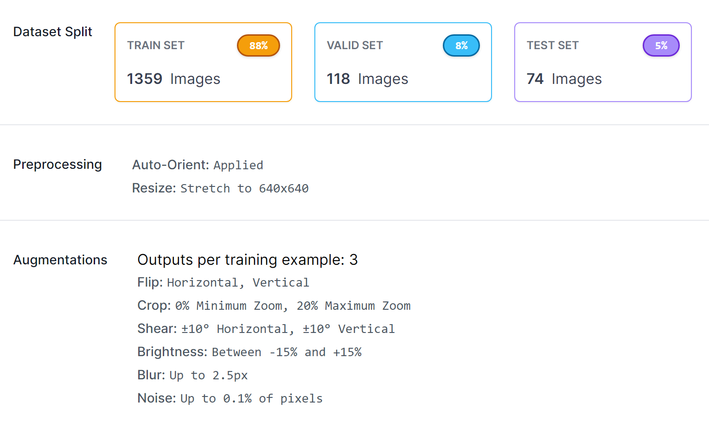

Guinea Pig Detection with YOLOv8 on a custom dataset
===============================

This repository contains code and data for guinea pig detection using YOLOv8. The code is organized into four main parts:

1.  `data directory`: It contains the custom dataset in YOLOv8 format (splitted into training, validation, testing parts).

2.  `notebooks directory`: This directory contains the training scripts in jupyter notebook format, which performs the training in 2 different datasets.

3.  `trained_models directory`: This directory contains the trained YOLOv8 models. `YOLOv8_small_dataset.pt` is the model which I trained on the small Roboflow dataset (131 images). `YOLOv8_larger_own_dataset.pt` is trained on my own larger dataset (1551 images).

4.  `inference.py`: This file contains the inference code for the models. The script detects the guinea pigs on the images of the test directory (or single test image) with the trained custom YOLOv8 model. After that it calculates the number of guinea pigs, remove the background of the ROI-s with `rembg` library and perform color analysis based on the `colorthief` library. In the result of this the detected guinea pigs are classified based on their primary color to `black` or `white` classes.

Dataset
-------

The first small dataset by Espol contains 131 total images. it can be downloaded from [here](https://universe.roboflow.com/espol-hdsba/cuydetection).

My own custom guinea pig dataset contains 1551 images in YOLOv8 format, therefore is splitted into training, validation, testing sets.
The dataset is hand-labeled, it contains mainly my own pictures, but I also used pictures from Roboflow and Kaggle.
The dataset is preprocessed and augmented, as you can see in the picture below.

If you want to use the dataset in other format, you can access it [here](https://universe.roboflow.com/projects-josub/guinea-pig-detection-grlwn/dataset/1).

